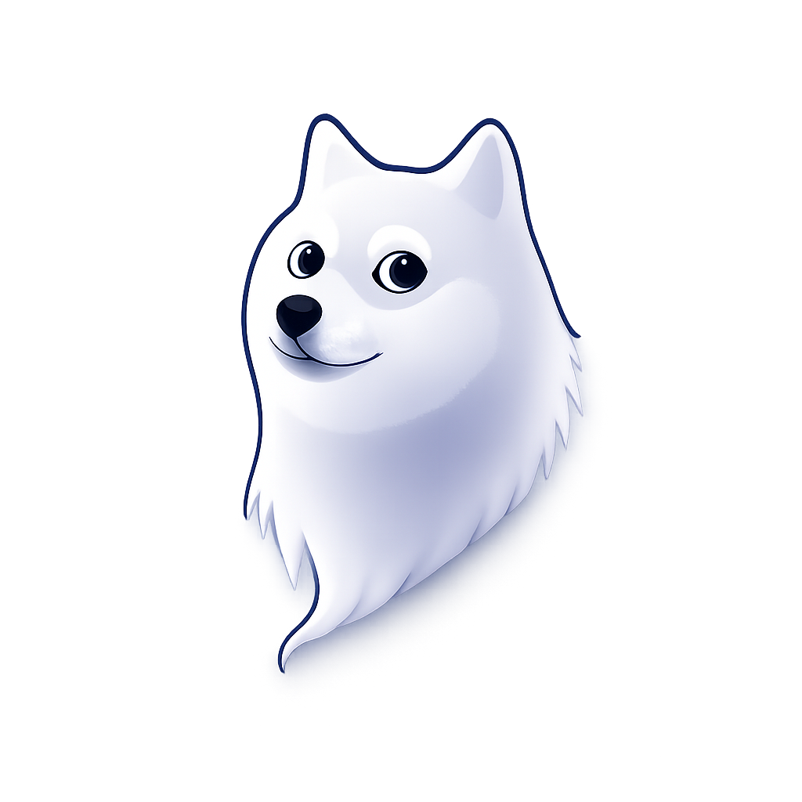

  

<h1 align="center">Spooky Doge Wallet</h1>

  <strong>A non-custodial Dogecoin wallet for the Spooky Society</strong>

  <em>Your keys. Your coins. Your Doginals.</em>

---

## What is Spooky Doge?

Spooky Doge is a secure, non-custodial Dogecoin wallet that gives you full control over your DOGE and Doginals (inscriptions). Available on iOS, Android, and as a browser extension for Chrome and Edge.

**Non-custodial** means your private keys never leave your device. Only you can access your funds.

---

## Getting the App

| Platform | Where to Get It |
|----------|-----------------|
| **iOS** | App Store (search "Spooky Doge") |
| **Android** | Google Play Store (search "Spooky Doge") |
| **Chrome/Edge** | Chrome Web Store (search "Spooky Doge Wallet") |

---

## Getting Started

### Creating a New Wallet

1. **Open the app** and tap **"Create New Wallet"**
2. **Set a password** - This encrypts your wallet. Choose something strong and memorable. If you forget it, you'll need your backup phrase to recover.
3. **Write down your backup phrase** - You'll be shown 12 words. Write these down on paper and store them safely. Never share them or take a screenshot.
4. **Verify your phrase** - Confirm a few words to prove you saved them correctly.
5. **Done!** Your wallet is ready to use.

### Importing an Existing Wallet

Already have a Dogecoin wallet? You can import it:

1. Tap **"Import Wallet"**
2. Choose your import method:
   - **Seed Phrase** - Enter your 12 or 24-word backup phrase
   - **Private Key (WIF)** - Enter your WIF-format private key
3. **Set a password** to encrypt the wallet on this device
4. Your wallet and balance will appear

---

## Main Features

### Home Screen - Viewing Your Balance

The home screen shows:
- **Total DOGE balance** for your active address
- **USD equivalent** based on current market price (updates automatically)
- **Your Dogecoin address** - tap to copy to clipboard
- **Recent transactions** - your last 5 transactions at a glance
- Quick access to **Send** and **Receive** buttons

**Switching Addresses:** Tap your address or account name to open the address selector. You can switch between addresses or manage your wallets from there.

**Switching Wallets:** Tap "Manage Wallets" in the address selector to see all your wallets, rename them, view backup phrases, or add new wallets.

---

### Sending DOGE

1. Tap the **Send** button
2. **Enter the recipient address** - Paste from clipboard or tap the camera icon to scan a QR code
3. **Enter the amount** in DOGE
4. **Review the transaction** - The app shows the amount, network fee, and recipient
5. **Confirm** - Authenticate with password or biometrics to sign
6. **Done!** You'll see a confirmation with the transaction ID

**Fees:** A small network fee (minimum 0.01 DOGE) is added automatically. The exact fee depends on transaction size.

**Doginal Protection:** UTXOs worth 0.1 DOGE or less are automatically protected and won't be spent as regular DOGE. This prevents accidentally destroying inscriptions.

#### Advanced Mode

For power users, toggle on **Advanced Mode** to select specific UTXOs (coins) to include in your transaction. As you select UTXOs, the screen displays running totals for your selected inputs along with the estimated network fee, dev fee, and change - all updating in real-time as you modify your selection.

---

### Receiving DOGE

1. Tap the **Receive** button
2. Your address is displayed as a **QR code** and text
3. **Share** the QR code or tap to copy the address
4. Send the address to whoever is paying you

**Tip:** Each HD wallet can generate multiple addresses. All addresses in the same wallet share the same backup phrase.

---

### Managing Multiple Wallets

You can have multiple wallets in one app:

1. From the home screen, tap your address or account name
2. Tap **"Manage Wallets"**
3. From here you can:
   - **Switch** between existing wallets (tap to select)
   - **Rename** a wallet (tap the edit icon)
   - **View backup phrase** for any wallet
   - **Add new wallet** - Create a new one or import an existing seed/WIF
   - **Add derived address** - Generate additional addresses from the same HD wallet
   - **Delete** a wallet (requires confirmation)

Each wallet is independently encrypted and can have its own backup phrase.

---

### Viewing Transaction History

1. Tap the **History** tab (clock icon)
2. See your transactions with:
   - **Amount** sent or received
   - **Date** of confirmation
   - **Status** - confirmed or pending
3. Tap any transaction to open it in a blockchain explorer

Pull down to refresh and load more transactions.

---

## Doginals (Inscriptions)

Doginals are digital artifacts inscribed on the Dogecoin blockchain - similar to NFTs.

### Viewing Your Doginals

1. Tap the **Doginals** tab
2. Browse your inscription collection in a tile/grid view
3. Each Doginal shows its image preview (or a placeholder icon if the image can't be loaded)
4. Tap any Doginal to see full details

### Sending Doginals

1. Go to the **Doginals** tab
2. Tap the **Select** button to enter selection mode
3. Tap the Doginal(s) you want to send
4. Tap **Send Selected**
5. Enter the recipient's Dogecoin address
6. Review and confirm the transaction

**Multi-Send:** You can select multiple Doginals to send in a single transaction.

**Protection:** Doginals are stored in small UTXOs (typically 0.1 DOGE or less). The wallet protects these from being spent as regular DOGE. When sending a Doginal, it's always placed as the first output to preserve ownership.

**Inscription Fee:** Sending Doginals has a slightly higher fee (0.10 DOGE per inscription) to ensure the transaction is processed properly.

---

## dApp Browser

The built-in browser lets you connect to Dogecoin decentralized applications (dApps).

### Using the dApp Browser

1. Tap the **Browser** tab (globe icon)
2. Enter a URL in the address bar or tap a favorite/recent site
3. Navigate the website like a normal browser
4. When a dApp requests to connect, you'll see an approval popup

### Connecting to dApps

When a dApp wants to interact with your wallet:
1. A popup appears asking for permission
2. **Review** what the dApp is requesting
3. **Approve** or **Deny** the request

**You always approve each action.** The dApp cannot spend your funds without your explicit confirmation.

### What dApps Can Request

| Request | Description | Approval Required |
|---------|-------------|-------------------|
| Connect | See your public address | Yes |
| Send DOGE | Create a transaction | Yes (shows amount/recipient) |
| Send Doginal | Transfer an inscription | Yes (shows which Doginal) |
| Sign Message | Sign data with your key | Yes |

### Managing Tabs

- **Multiple tabs** - Tap the tabs icon to see all open tabs
- **Add new tab** - Tap the + button
- **Close tab** - Swipe or tap X on a tab
- **Tabs persist** - Your open tabs are saved when you close the app

### Favorites and Recent Sites

- **Add to favorites** - Tap the menu icon and select "Add to Favorites" (star icon)
- **Recent sites** - Recently visited sites appear for quick access
- **Set homepage** - Choose which site loads when you open a new tab

### Managing Connected Sites

See which sites have permission to connect:
1. Go to **Settings** tab
2. Tap **Connected Sites**
3. View all connected dApps
4. Tap a site and confirm to disconnect (revokes its access)

### For Developers

Building a dApp that works with Spooky Doge? See the complete integration guide: [**SPOOKY_INTEGRATION.md**](./SPOOKY_INTEGRATION.md)

---

## UTXO Management

For advanced users who want to see exactly what's in their wallet:

1. Tap the **UTXOs** tab
2. View all your unspent transaction outputs
3. See which UTXOs are:
   - **Spendable** - Available for regular transactions
   - **Protected** - Small UTXOs (0.1 DOGE or less) that may contain Doginals

This tab helps you understand your exact balance breakdown and see protected inscription outputs.

---

## Settings

Access settings by tapping the **Settings** tab (gear icon).

### Security Options

| Setting | Description |
|---------|-------------|
| **Lock Wallet** | Immediately lock the wallet, requiring password to unlock |
| **Biometric Unlock** | Enable fingerprint or Face ID for quick unlocking |

To enable biometrics:
1. Toggle on the biometric option
2. Enter your password to confirm
3. Verify with your fingerprint or face

### Connected Sites

View and manage which dApps have permission to see your address:
- See all connected sites
- Tap a site and confirm the popup to disconnect it

### Account Actions

| Action | Description |
|--------|-------------|
| **Lock** | Lock the wallet (keeps data, requires password to unlock) |
| **Sign Out** | Delete all wallet data from this device (requires backup phrase to recover) |

**Warning:** Sign Out permanently deletes your wallet from the device. Make sure you have your backup phrase before signing out!

---

## Security Features

### How Your Wallet is Protected

| Feature | Description |
|---------|-------------|
| **AES-256 Encryption** | Your seed phrase and private keys are encrypted with your password using industry-standard encryption |
| **Local-Only Keys** | Private keys never leave your device and are never sent to any server |
| **Secure Storage** | On mobile, secrets are stored in the iOS Keychain or Android Keystore - the most secure storage on your device |
| **Session Lock** | Decrypted keys are only in memory while the app is unlocked |
| **Auto-Lock** | Wallet locks automatically after 30 minutes of inactivity or 5 minutes in the background |
| **Biometric Auth** | Use fingerprint or Face ID to quickly unlock without typing your password |
| **Doginal Protection** | Small UTXOs (0.1 DOGE or less) are protected from accidental spending |

### Best Practices

1. **Write down your backup phrase** on paper, not digitally
2. **Store your backup** in a safe place (fireproof safe, bank deposit box)
3. **Never share** your seed phrase or private keys with anyone
4. **Use a strong password** - at least 12 characters with mixed case, numbers, and symbols
5. **Enable biometrics** for convenient but secure quick access
6. **Verify addresses** carefully before sending - transactions cannot be reversed

### What Happens If...

| Scenario | Solution |
|----------|----------|
| **I forgot my password** | Use your 12/24-word backup phrase to restore your wallet |
| **I lost my phone** | Your wallet is encrypted. Install the app on a new device and restore with your backup phrase |
| **I lost my backup phrase** | If you still have access, go to Manage Wallets and tap to view the backup phrase. If you've lost both the phrase and access, your funds cannot be recovered |
| **Someone saw my screen** | Your password and seed phrase are hidden by default. If someone saw your full seed phrase, immediately transfer funds to a new wallet |

---

## Fees Explained

| Fee Type | Amount | Purpose |
|----------|--------|---------|
| **Network Fee** | ~0.01+ DOGE | Paid to Dogecoin miners to process your transaction. Varies by transaction size. |
| **Inscription Fee** | 0.10 DOGE per Doginal | Higher fee for Doginal transfers to ensure inscription data is preserved |
| **Dev Fee** | 0.01 DOGE | Small fee to support ongoing wallet development |

---

## Frequently Asked Questions

### General

**Q: Is Spooky Doge free?**
A: Yes! The app is free to download and use. You only pay network fees when sending transactions.

**Q: Can I use the same wallet on multiple devices?**
A: Yes. Import your wallet using your seed phrase on any device. All devices will share the same addresses and funds.

**Q: What if Spooky Doge shuts down?**
A: Your funds are safe. Since you have your seed phrase, you can import it into any other Dogecoin wallet that supports BIP44 standard derivation (most wallets do).

### Doginals

**Q: Why can't I see my Doginal's image?**
A: Image loading depends on external services. If an image doesn't load, try refreshing or check your internet connection. The Doginal is still safely in your wallet.

**Q: Why is there 0.1 DOGE protection?**
A: Doginals are stored in small UTXOs. Without protection, you might accidentally spend these as regular DOGE, destroying the inscription. The wallet prevents this by requiring explicit selection to send Doginals.

**Q: Can I inscribe new Doginals with this wallet?**
A: Currently, Spooky Doge supports viewing and sending existing Doginals. For inscribing new ones, use a dedicated inscription service.

### Security

**Q: Can Spooky Doge access my funds?**
A: No. Your private keys are encrypted and stored only on your device. The Spooky Doge team has no access to your keys or funds.

**Q: Is my seed phrase sent to any server?**
A: Never. Your seed phrase is generated locally and encrypted locally. It never leaves your device.

**Q: What if I find a bug or vulnerability?**
A: Please report it responsibly by contacting the development team directly. Do not post security issues publicly.

---

## Troubleshooting

| Issue | Solution |
|-------|----------|
| **Balance not updating** | Pull down to refresh. Check your internet connection. |
| **Transaction stuck/pending** | Dogecoin typically confirms in 1-2 minutes. If longer, the network may be congested. |
| **Can't send - "Insufficient funds"** | Your spendable balance excludes protected Doginal UTXOs. Check the UTXOs tab to see your breakdown. |
| **dApp not connecting** | Make sure you approved the connection request. Try refreshing the page. Check Settings > Connected Sites. |
| **Biometrics not working** | Go to Settings and re-enable biometric unlock. Ensure your device has biometrics set up. |
| **Wrong password error** | Passwords are case-sensitive. If you've forgotten it, restore using your backup phrase. |
| **Doginal not showing** | Pull to refresh. Some inscriptions may take time to index. |

---

## For Developers

Want to integrate your dApp with Spooky Doge wallet? 

See the complete integration guide: [**SPOOKY_INTEGRATION.md**](./SPOOKY_INTEGRATION.md)

The wallet provides an EIP-1193 compatible `window.dogecoin` provider with methods for:
- Requesting account access
- Sending DOGE transactions
- Getting and sending Doginals
- Message signing
- Event subscriptions

---

## Support

- **Community:** Join the Spooky Society community
- **Issues:** Report bugs through official channels
- **Updates:** Follow for the latest features and security updates

---

  <strong>Built with care for the Spooky Society</strong>

  <em>Much wow. Very secure. So spooky.</em>

